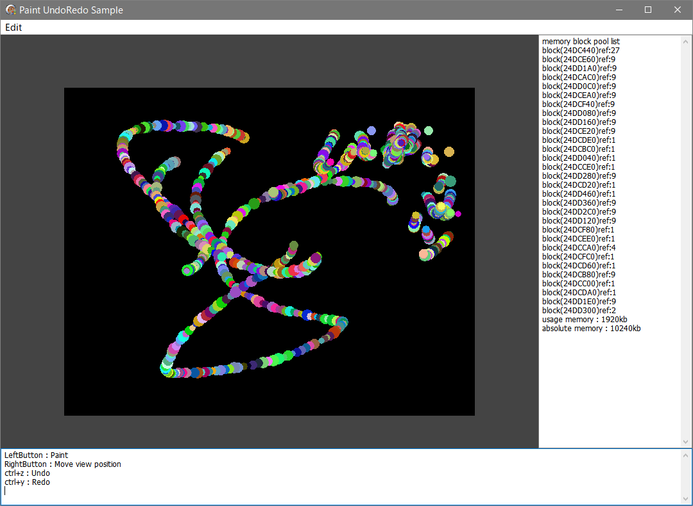

# Simple undo redo & undo data compaction 
Simple undo redo manage code. and duplicate memory optimize code.\
単純なUndoRedo管理コードと、UndoRedo時に役立つメモリ重複最適化コードです。\
Use there anything other than the editor? :Q \
エディタ以外で使う（役立つ）ことは……たぶんないでしょう。\
About 10KB each , too tiny :-)\
だいたいそれぞれ10KBぐらいのとてもちっちゃいコードです。

## Sample
Sample is simple paint application.\
サンプルは単純なペイントアプリです。\
It will test undo and optimize undo data.\
undoの動作テストとundoデータの最適化を行います。\
Divide the area with 128 x 128 pixels, Reduce memory usage by optimize the same area image.\
キャンバスを128x128のエリアに分割し、同じ内容の部分を最適化することでメモリ使用量を減らします。

usage memory compactioned to about 1/5 in the sample image.\
サンプル画像で、使用メモリ約1/5ぐらいに最適化されています。

## Use undo redo (uUndoData.pas)
Define undoredo data class.\
まずundo用データクラスを定義します。用途によって内容を変えてください。\
It need to create(override) compare and replicate functions.\
定義したデータ用の比較、複製用メソッドをoverrideする必要があります。


```delphi
type
  TSingleUndoObjectMemoryStream=class(TSingleUndoObjectBase)
    public
      data : TMemoryStream;

      constructor Create;
      destructor  Destroy; override;
      function    Compare(other:TSingleUndoObjectBase):boolean; override;      // compare self and other
      function    Replicate:TSingleUndoObjectBase; override;                   // replicate(duplicate) self class
  end;
```
Create manager , Push and pop the data class.\
あとはundoredo管理クラスを生成して、先のデータをプッシュポップするだけ。\
If undodata is no changed , not add it.\
もしデータに変化が無い場合は、追加しません。
```delphi
  // create manager
  undo := TSingleUndo.Create;
  // create undo data & push(add) undo
  data := TSingleUndoObjectMemoryStream.Create;
  data.data := HogeObject.ReplicateSerializeData;  // replicate MemoryStream
  undo.Add(data); // add,push. the same data is not added.
  data.Free;
  // undo redo
  if not(undo.IsUndoEmpty) then data := undo.Undo; // undo
  if not(undo.IsRedoEmpty) then data := undo.Redo; // undo
  // free manager
  undo.Free
```

## Use memory compaction (uMemoryBlock.pas)
Create pool manager class.\
まずプール（蓄えて管理）する管理クラスを生成。
```delphi
  // create
  pool := TmemoryBlockPool.Create;
  // free
  pool.Free;
```
Get the optimize block class from MemoryStream(or memory pointer).\
メモリデータから重複を最適化されたblockクラスを取得します。
Please use pool.FreeBlock() to release(free) the block class.
blockクラスの解放にはプールのFreeBlockを使用ください。
```delphi
  // get block from TMemoryStream
  ms := HogeObject.GetSerializeData; // reference MemoryStream
  block := pool.GetBlock(ms);
  // get block from memory pointer
  ptr := ms.Memory;
  size := ms.Size;
  block := pool.GetBlock(ptr,size);
  // free block
  pool.FreeBlock(block);
```
## etc
そのうちTypeScriptで作るかもしれません。ExtJS(Sencya)環境下で使うかも知れませんので……。

